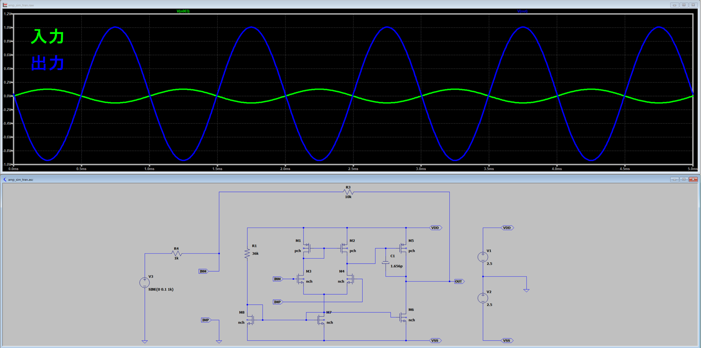
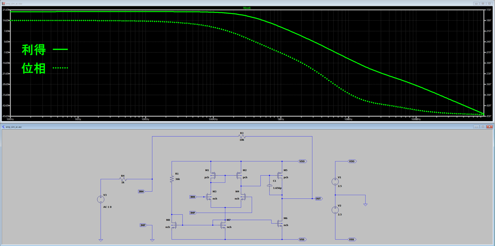

# Two-Stage-CMOS-Op-Amp：レイアウトにこだわった2段オペアンプ

## 概要、作った理由
ミニマルファブの設計コンテストに応募させていただきます。  

レイアウトにこだわって、2段構成の演算増幅器を作成しました。  
Metal2の代わりにゲート端子用のTiN層を利用することで、アナログ回路を設計することができました。

- 学校で集積回路について学んでいて、ミニマルファブで作れる機会を先生からいただきました。  
- レイアウトの制約がある中で、王道のオペアンプを設計出来たら楽しそうだと思って挑戦しました。

## 回路の説明
基本的な2段構成のオペアンプです。電源電圧は±2.5Vで設計しています。  
設計ツールは「LTspice」を使用しました。

- 回路設計の工夫
  - MOSの分割数や抵抗・キャパシタのパラメータは、レイアウトを常に意識しながら設計しました。
  - MOS・抵抗・キャパシタの決められた配置を活用できるような素子値にすることで、  
    レイアウトのきれいさを保ちながら規模の大きい回路を作ることができました。
  - 抵抗はP型10個分の36kΩ、キャパシタは4個分の1.656pFにしています。

### 回路図

| MOS | ch. | multiplier |
:---:|:---:|:---:
|M1 |P |2 |
|M2 |P |2 |
|M3 |N |1 |
|M4 |N |1 |
|M5 |P |8 |
|M6 |N |4 |
|M7 |N |2 |
|M8 |N |4 |

### シミュレーション
- 解析コマンド「.tran 0 5m 1u」
- 入力信号「振幅0.1mV、周波数1kHz」

- 解析コマンド「.ac 100 1G 100」
- 入力信号「振幅1V」

## レイアウトの説明
ツールは「KLayout」を使用しました。グリッドは0.5umでレイアウトをしました。

- レイアウトの工夫
  - Metal2の代用としてゲート端子用のTiN層を利用することで、
    Metal1のみではできない配線を実現することができました。
  - 素子の配置をレイアウト中に何度も調整しました。
  - MOS同士の接続・端子への接続がしやすい最適な配置が見つかり、DRCとLVSともに完了しています。

### レイアウト図

### 入出力PIN
| PIN | 番号 |
:---:|:---:|
|VDD |n22 |
|VSS |n08 |
|INP |n23 |
|INM |n24 |
|OUT |n09 |

### レイアウトの素子配置

## ミニマルファブにかける熱い思い
- 私は学校で同級生にサーキットデザインについて伝えています。
- 今回ミニマルファブで設計する機会をいただき、わずか2週間ほどで製造が完了すると知ってすごく驚きました。
- いつか小学生がオリジナルのICを作るような世の中になればいいなと思っているので、
  今回コンテストに参加することができて光栄です。
- この度はオープンソースのPDK、およびマニュアルをご提供くださってありがとうございました。
